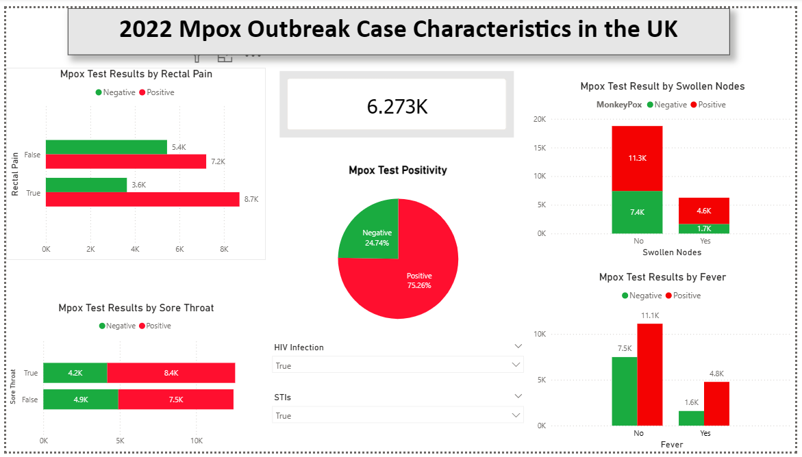

# 

# Analysis of the Clinical Indicators for Mpox Infection in the UK


## Overview
Mpox (formerly referred to as monkeypox) is an infectious disease typically characterised by a rash and influenza-like symptoms. It is caused by the monkeypox virus, which can affect both humans and certain animal species. Initial symptoms include fever, headache, myalgia, lymphadenopathy, and fatigue. Although the overall risk of contracting Mpox in the UK remains low, several outbreaks have been reported in specific regions since 2022. This project examines the 2022 UK Mpox outbreak, which commenced on 6 May 2022 in London. The first confirmed case involved a British resident who had recently travelled to Nigeria—where the disease is endemic—and returned on 4 May, serving as the index case for this outbreak. 

This analysis aimed to generate actionable public health insights and build predictive models that can classify individuals’ Mpox risk based on clinical indicators and co-infections.

The work follows the full data analytics pipeline: Extract, Transform, Load (ETL) → Feature Engineering → Exploratory Data Analysis (EDA) → Hypothesis Testing → Machine Learning (ML) → Power BI Dashboard → Ethics & Governance.

## Dataset Content
This project utilized a publicly accessible Mpox outbreak dataset obtained from the Kaggle website (https://www.kaggle.com/datasets/muhammad4hmed/monkeypox-patients-dataset) on December 5, 2025. The dataset is synthetic, generated based on research published by the British Medical Journal: "Clinical features and novel presentations of human monkeypox in a central London centre during the 2022 outbreak: descriptive case series." Provided in CSV format, the dataset comprises records for 25,000 patients, each annotated with various attributes—including Patient_ID, Systemic Illness, Rectal Pain, Sore Throat, Penile Oedema, Oral Lesions, Solitary Lesion, Swollen Tonsils, HIV Infection, and Sexually Transmitted Infection—as well as a target variable indicating monkeypox diagnosis.

The data is anonymised, publicly available, and licensed for research purposes.

## Business Requirements
The main objective of this analysis was to investigate individual-level clinical indicators of Mpox infection. The following were the specific objectives of the analysis.
1.	To compute test positivity rate for the 2022 Mpox outbreak. This is the proportion of all Mpox tests that returned a positive result.
2.	To examine the relationship between various clinical attributes or indicators and Mpox diagnosis.
3.	To determine the effects of clinical attributes or indicators on Mpox diagnosis

## Why this analysis?
Although the outbreak was effectively contained, it remains crucial from a public health standpoint to analyse case characteristics and predisposing factors to guide future initiatives, including targeted prevention measures, early intervention protocols, and tailored health strategies to address potential issues before they escalate.

## Main User Stories

### Story 1 — Epidemiologist
**As** an Epidemiologist, I would like to know the test positivity rate for Mpox, **So that** I can effectively monitor Mpox transmission and assess adequacy for the testing services.

Analytical Tasks (post ETL):
1.	Compute frequency using Mpox test results variable
2.	Prepare pie chart for Mpox test results - Dashboard
3.	Prepare Bar graph of Mpox test results by HIV or STI Status
4.	Table of Mpox results by systemic illness, rectal pain, sore throat, penile oedema, oral lesions, solitary lesion and swollen tonsils

### Story 2 — Public Health Manager
**As** a Public Health Manager, I would like to understand the relationship between STIs and Mpox, **So that** I can develop targeted interventions to prevent, improve diagnosis and treatment of Mpox.

Technical tasks (post ETL):
1.	Perform a chi-square test between Mpox diagnosis and the following: HIV infection and STIs
2.	Perform logistic regression with Mpox diagnosis as an outcome and the following as covariate: HIV infection and STIs
3.	Fit supervised ML pipeline model to predict Mpox diagnosis based on the following features: HIV infection and STIs.
4.	Assess the importance of features to determine effects of HIV and STI status on Mpox diagnosis

### Story 3 — Medical Doctor
**As** a Medical Doctor, I would like to know the key clinical indicators of the Mpox infection, **So that** I can identify suspected cases quickly, order further investigations that would then allow me to provide appropriate care.

Technical tasks (post ETL):
1.	Perform a chi-square test between Mpox diagnosis and the following symptoms: systemic illness, rectal pain, sore throat, penile oedema, oral lesions, solitary lesion and swollen tonsils
2.	Perform logistic regression with Mpox diagnosis as an outcome and the following as covariate to understand their effects: systemic illness, rectal pain, sore throat, penile oedema, oral lesions, solitary lesion and swollen tonsils
3.	Fit supervised ML pipeline model to predict Mpox diagnosis based on the following features: systemic illness, rectal pain, sore throat, penile oedema, oral lesions, solitary lesion and swollen tonsils.
4.	Assess the importance of features to determine clinical indicators for Mpox

## Hypothesis and How to Validate Them

The analyses were driven by the following hypothesis:

### Hypothesis 1
**Null**: There is no significant association between having an HIV infection or sexually transmitted infections (STIs) and Mpox diagnosis.
**Alternative**: Having HIV infection or STIs is significantly associated with Mpox diagnosis.
**Validation procedure:** Build a 2×2 contingency table (`pd.crosstab`), run Chi-square, record p-value and effect size.

#### What did i find?

- There is insufficient evidence to reject a null hypothesis. There is no significant association between having an HIV infection or STIs and Mpox diagnosis.

```js
Chi-square test for HIV Infection vs MonkeyPox:
Chi2 Statistic: 533.6958762438375, p-value: 4.435025614165891e-118

Chi-square test for Sexually Transmitted Infection vs MonkeyPox:
Chi2 Statistic: 380.028262287027, p-value: 1.2268969903563724e-84
```

### Hypothesis 2
**Null**: There is no significant association between rectal pain, sore throat, penile oedema, oral lesions, solitary lesion or swollen tonsils and Mpox diagnosis.
**Alternative**: Having rectal pain, sore throat, penile oedema, oral lesions, solitary lesion or swollen tonsils is significantly associated with Mpox diagnosis.
**Validation procedure:** Build a 2×2 contingency table (`pd.crosstab`), run Chi-square, record p-value and effect size.

#### What did I find?

- Insufficient evidence to reject a null hupothesis. There is no significant association between systemic illness, rectal pain, sore throat, penile oedema, oral lesions or solitary lesion and Mpox diagnosis.

```js
Chi-square test for Solitary Lesion vs MonkeyPox:
Chi2 Statistic: 34.94706665962249, p-value: 3.38791411460228e-09

Chi-square test for Oral Lesions vs MonkeyPox:
Chi2 Statistic: 67.26697985273577, p-value: 2.3711975473141775e-16

Chi-square test for Penile Oedema vs MonkeyPox:
Chi2 Statistic: 95.54987650703023, p-value: 1.442118438462757e-22

Chi-square test for Sore Throat vs MonkeyPox:
Chi2 Statistic: 100.17850932207872, p-value: 1.3926240122068867e-23

Chi-square test for Rectal Pain vs MonkeyPox:
Chi2 Statistic: 494.51442414581163, p-value: 1.4843418683896628e-109
```

- Hypothesis 2: There is sufficient evidence to reject the null hypothesis that there is no significant association between swollen tonsils and Mpox diagnosis, p-value < 0.05

```js
Chi-square test for Swollen Tonsils vs MonkeyPox:
Chi2 Statistic: 4.315230405742069, p-value: 0.037772655452152144
```

### Hypothesis 3
**Null**: Having an HIV infection or STIs does not significantly increase the likelihood of testing positive to Mpox.
**Alternative**: Having HIV infection or STIs significantly increases the likelihood of testing positive to Mpox.
**Validation procedure:** Build a logistic regression models to examine the relationship, compute coeffiecients and Odd ratio; record p-value and effect size.

#### What did I find?

- There is sufficient evidence to reject the null hypothesis. Rectal Pain, Sore Throat, Penile Oedema, Oral Lesions, Solitary Lesion, Swollen Tonsils, HIV Infection, Sexually Transmitted Infection, Fever, and Swollen Nodes significantly increase the likelihood of testing positive to Mpox. However, Having muscle aches was not a significant factor.

```js
Features                            2.5%     97.5% Odd Ratio
const                           0.239989  0.290525  0.264051
Rectal Pain                     1.792845  2.002385  1.894721
Sore Throat                     1.279147  1.427844  1.351452
Penile Oedema                   1.256998  1.403017  1.328002
Oral Lesions                    1.217136  1.358604  1.285926
Solitary Lesion                 1.125075  1.255681  1.188585
Swollen Tonsils                 1.018454  1.136640  1.075925
HIV Infection                   1.862129  2.079792  1.967953
Sexually Transmitted Infection  1.693049  1.890814  1.789201
Fever                           2.564307  3.000190  2.773700
Swollen Nodes                   2.356677  2.755009  2.548071
Muscle Aches                    0.878524  1.017955  0.945673
```

### Hypothesis 4
**Null**: Rectal pain, sore throat, fever, swollen nodes, muscle aches, penile oedema, oral lesions, solitary lesion or swollen tonsils are not significant indicators or predictors of Mpox infection.
**Alternative**: Rectal pain, sore throat, fever, swollen nodes, muscle aches, penile oedema, oral lesions, solitary lesion or swollen tonsils are significant indicators or predictors of Mpox infection.
**Validation procedure:** Build a logistic regression models to examine the relationship, compute coeffiecients and Odd ratio; record p-value and effect size. In addtion, develop an ML predictor model and extract important features.

#### What did I find?
- After fitting the ML model and evaluating it's performance, only five features were important predictors of Mpox Infection. 

```js
Feature  Importance
4                   Swollen Nodes    0.286799
1                   HIV Infection    0.206491
0                     Rectal Pain    0.182951
3                           Fever    0.175476
2  Sexually Transmitted Infection    0.148283
```

## Project Plan

**Overview of Key Steps Completed**

### 1 – ETL (Extract, Transform, Load)  
- Extracted the dataset from Kaggle and loaded it in python
- Checked the first and last five rows. This is a quick way to see if all columns look aligned and if the data visually makes sense.
- Checked the shape of the data to confirm number of rows and columns
- Checked columns names, data types and non-null count for variables
- Checked unique values for all columns
- Quantified the missiong values in columns
- Checked for duplicates.

Key observations
- Only one variables (systemic illness) has missing values, which seems significant
- Data type for 2 of 11 is object, the rest are boolean
- The dataset includes Patient_ID, which may be used to identify the patients
- No duplicates were identified.
- The data has no personal information or individual attributes 

### 2 – Feature Engineering  and data manipulation

#### Missing data
- The symptoms under the systemic variable are important feature for predictive modelling. But about 25% of the values were missing. Given the nature of the variable, it seems the missing values were for those who didn't have any symptoms. So, I decided to label all missing values as None.
- Saved the cleaned dataset as CSV for downstream EDA and hypothesis testing.

#### Encoding
- Boolean were replaced with 1 for True and 0 for False
- MonkeyPost Test results were encoded as 1 for Positive and 0 for negative
- Systemmic Illness were also encoded with numbers to represent each symptom
- The data types was then changed to object to avoid statistical computations on these variables
- Saved the cleaned and encoded dataset as CSV for downstream analysis in the Dataset folder.

### 3 – Exploratory Data Analysis (EDA) & Hypothesis Testing  
- Conducted visualisation and summary statistics to identify patterns or associations between Mpox and all features.  
- Mapped business hypotheses (e.g., associations between Mpox and features) to appropriate statistical tests:  
  - Chi-square tests for categorical relationships  
- Recorded p-values and effect sizes

### 4 – Data Modelling, including Machine Learning (ML)  
I used logistic regression to examine relationship between Mpox infection and each of the independent variables
- Logistic regression is primarily used to model and predict categorical outcomes, especially binary ones (e.g., Yes/No, True/False, 0/1). It estimates the probability of an event occurring based on input variables.
- It helps to identify which independent variables significantly influence the likelihood of an outcome.

I performed ML modelling for two specific reasons:
- To develop a model that can predict that a person has Mpox infection based on the clinical indicators and or presence of sexually-transmitted infections
- To identify important clinical indicators and infections that healthworker cares should pay close attention to during Mpox outbreaks and they are strongly linked to Mpox infection - feature importance.
  * Split data into training and test sets (e.g., 80/20 split).  
  * Evaluated the classifiers and extracted feature importance  
  * Assessed performance using metrics such as Accuracy, Precision, Recall, F1-score.  
  * Compared models and documented findings (report or notebook summary).

### 5 – Power BI Dashboard Development  
Built an interactive dashboard using produced charts and KPIs:



Given the dataset only had binary categorical variables, the dashbaord has the following visualizations: 

#### Pie Chart
- To show proportions or percentages of a whole in a simple, visual way. It’s one of the most intuitive charts because people can quickly see how each slice compares to the entire circle.
- It was used to emphasize how Mpox test results were divided up during the outbreak

#### Stacked column charts
- Are a powerful way to show how parts contribute to a whole across multiple categories while also allowing comparison between groups. They’re essentially vertical bar charts where each bar is divided into segments (the “stack”), representing subcategories.
- It was used to visualize categorical distributions of Mpox infection across people who had swollen nodes or not.

#### 100% stacked bar chart
- This is a type of bar chart where each bar represents 100% of a category, and the segments within the bar show the relative proportion of subcategories. Unlike a regular stacked bar chart (which shows absolute values), the 100% version normalizes all bars to the same length, making it easier to compare proportions across categories.
- It was used mainly to show Mpox distribution shifts across groups (sore throat or no sore throat) without letting absolute sample sizes dominate the story.

#### Clustered column and bar charts
- They are designed to make direct comparisons between subcategories across multiple groups. Instead of stacking values in one bar, the chart places them side by side (clustered) within each category.
- I used these charts to compare subcategories (Fever or no fever and rectal pain or no rectal pain) directly across Mpox test results

#### Card
- A Card in Power BI is designed to display a single key metric or value in a clean, prominent way. It is like a digital “dashboard speedometer” that highlights the most important number you want your audience to notice.
- I used this to display the total number of people that were tested for Mpox infection. As you go through the charts, this number changes and display absolute number of people for the chart in focus.

#### Dashboard Location
- The dashboard was completed and published to Power BI Service (link: https://app.powerbi.com/groups/me/reports/1513dd0f-71c5-4f12-8d42-408ee0fbec79/18420d092b7640351123?experience=power-bi)
- The dashboard is also saved with the name "Mpox Dashboard.pbix" in the repository under the folder named Power_BI_Dashboard
- The dashboard has also been pushed to github.

## Data Management Practices:
- Large datasets tracked with Git LFS.
- Version-controlled outputs at each stage (cleaned, ml_ready, sample).
- Documented transformations for reproducibility.

## Analysis Techniques Used

- Data Cleaning: Imputed missing data, splited variables and ensured consistent data types.
- Feature Engineering: Encoding categorical variables, scaling features.
- Logistic regression modelling 
- ML preparation and Testing.

## Limitations
- Class imbalance (Mpox vs no Mpox).
- Lack of personal attributes like age, gender, education, residential area, etc limit data exploration for predictors
- Only categorical data available meant I could not perform certain analysis or produce certain charts

AI Tools:
- Used AI assistance to generate code explanations, improve markdown documentation, and plan project structure.
- Used AI to fix bugs
  
## Ethical Considerations
### 1) Data privacy & governance
- **Source & identifiability:** This project uses a publicly available, de-identified from Kaggle.No direct personal identifiers are included.  
- **Data minimisation:** Only fields necessary for analysis were retained; derived/aggregated outputs are shared (e.g., charts, summary CSVs).  
- **Repository:** No sensitive credentials or private data are stored in the repo. Large raw files are avoided; only the cleaned dataset required for reproducibility is included.  
- **GDPR mindset (good practice):** Although data are de-identified, we follow the principles of **lawfulness, fairness, transparency**, **data minimisation**, **storage limitation**, and **integrity/confidentiality**.

### 2) Bias, fairness & representativeness
- **Sampling bias:** This was a synthetic dataset. So, representation issues may not arise also given that sample characteristics were not included.  
- **Model fairness:** Predictive performance can vary across subgroups (e.g., Sex, Age). Given information about the sample was not provided, no check was done for disparities.

### 3) Appropriate use & harm reduction
- **No clinical use:** The dashboard and models are **educational** and **exploratory**; they are **not** medical devices and must not be used for diagnosis or treatment decisions.  
- **Association ≠ causation:** The dataset is cross-sectional. Hypothesis tests and models show associations, **not** causal effects.  
- **Threshold trade-offs:** Classification thresholds affect false positives/negatives. Any recommended threshold should be motivated by the chosen objective (e.g., prioritising recall to reduce missed high-risk cases) and clearly communicated.  
- **Transparency:** I have reported model metrics (Accuracy, Precision, Recall, F1) and provide plain-English summaries so non-technical readers understand limitations.

### 4) Governance, licensing & attribution
- **Attribution:** Dataset source and tools (e.g., Python libraries, AI assistants) are credited in the *Credits* section.  
- **Permissible use:** Data are used for non-commercial, educational purposes in line with the source’s terms.  
- **Version control:** Changes are tracked via Git with meaningful commit messages to ensure accountability and reproducibility.

### 5) What we implemented in this project
- Used a **cleaned, de-identified** dataset and stored only what’s required for reproducibility.  
- Reported **statistical significance and effect sizes** to avoid over-claiming results.  
- Evaluated models and exported metrics transparently; avoided presenting predictions as clinical advice.  
- Ensured dashboard copy will state “**in this dataset**” and avoid population-level claims unless weights are applied.

### 6) Planned before submission (quality checks)
- Add a short **disclaimer card** on the dashboard (educational use, association ≠ causation).  
- **Subgroup fairness check:** compute and document model metrics by Sex and Age bands; comment on any notable disparities.  
- Review colour choices and labels for **accessibility** (high contrast, no red/green dependence, readable titles/tooltips).

## Unfixed Bugs

- **Power BI:** Categorical variables only works when you add them to both x and y axis values. Not sure why, it took me time to figure out this trick.
- **Python in Power BI:** I attempted to plot sns charts in Power BI that cannot be done in Power BI. However, the distributions were different to the ones in jupyter notebooks. After several attemptS, I abandoned the idea and developed all charts using Power BI functions. 
- **Mobile responsiveness:** Some visuals in Power BI may require scrolling or lose detail on smaller devices.

## Development Roadmap
  
- Perform EDA in Python
- Define and test hypotheses statistically.
- Train and evaluate ML classification models.
- Build Power BI dashboards with different types of charts answering business requirements.
- Document ethics and governance considerations.
- Prepared README with all completed sections.

## Deployment

- This project does not use Heroku as the final dashboard was built in Power BI and uploaded in repo. 

## Main Data Analysis Libraries

These were the primary tools used for data cleaning, transformation, analysis, and modelling:
- pandas — Data loading, cleaning, transformation, and manipulation.
- numpy — Numerical operations and array manipulation.
- matplotlib — Static visualisations for EDA and results presentation.
- seaborn — Statistical visualisations such as correlation heatmaps and boxplots.
- scikit-learn — Feature encoding, scaling, model training, and evaluation.
- plotly (planned for EDA) — Interactive visualisations for deeper exploration.
- Power BI — Interactive dashboard creation and presentation of insights.

## Conclusions

The main findings from this analysis are:
1. That the test positivity of 2022 Mpox outbreak was very high at 64 percent. In the future, the adequancy of the testing would need to be reviewed and improves as necessary.
2. While no significant relationship was found between Mpox test results and most of the clinical features, further analysis through logistic modelling shows that most of the clinical features increased the likelihood of a positive Mpox test
3. The Mpox ML model has further pinpointed that HIV infection, Rectal Pain, Fever, and STIs as the most important clinical features in predicting Mpox test results.

## Future Improvements

In future, with more time and appropriate data, the following would be important to explore:

- Conduct hyperparameter optimisations
- GridsearchCV to find right model - Combine multiple algorithms for improved performance
- Get more data to improve model performance
- In the ML, Deep Learning Models: Neural networks for complex pattern recognition

## Final Reflection

- This capstone project facilitated the advancement of my technical abilities in data science and machine learning, while also enhancing my understanding of the complexity and responsibility inherent in healthcare analytics.
- This work showcases my ability to make a valuable difference in data-driven healthcare as a junior data analyst, blending strong technical skills with a real commitment to improving patient outcomes.
- Looking ahead in my data science career, I am dedicated to applying my skills to create positive change, especially in healthcare, where data science has the potential to make a direct difference in people’s lives.


## Credits

Content:

- Dataset: Kaggle – Diabetes Health Indicators- https://www.kaggle.com/datasets/alexteboul/diabetes-health-indicators-dataset
- Code Institute tutor guidance
- Code Institute LMS. Data Analytics with Artificial Intelligence Bootcamp Curriculum. Code Institute Ltd
- AI assistance: Co-Pilot 
- ChatGPT — for project planning, code explanation, documentation drafting, and workflow structuring
- GitHub Copilot — for code suggestions, code refinement, optimisation, and syntax completion during development
- ower BI - ULTIMATE Power BI Tutorial Beginner to Pro Course (2024) https://www.youtube.com/watch?v=Dk25lwdTKow&t=2256s
- Make a Power BI Dashboard in 15 Minutes! https://www.youtube.com/watch?v=NISsW-bVAwU
- Code Academy - Markdown Tables https://www.codecademy.com/resources/docs/markdown/tables
- Markdown Live Preview - https://markdownlivepreview.com/

## Media:

All visuals created in Python or Tableau during project development.

## Acknowledgements:

Special thanks to tutors, peers, and Code Institute resources for feedback and support.

